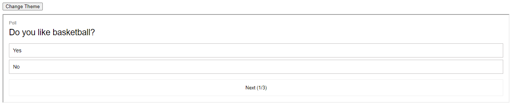
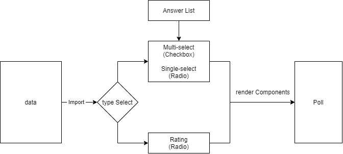
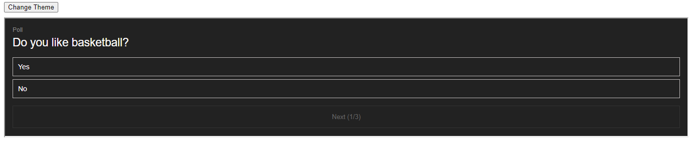
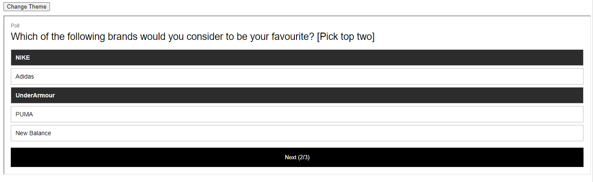
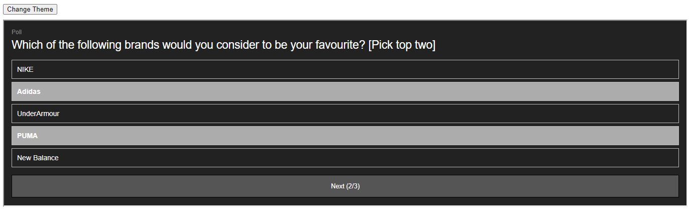
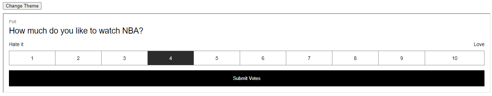
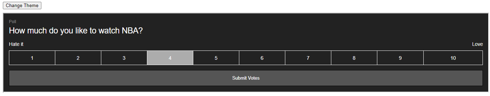

## Table of Content
1. [Project Information](#appinfo)
2. [Technologies](#technologies)
3. [Design](#design)
4. [Features](#features)
5. [Installation](#installation)

<a name="appinfo"></a>
## Project Information
This project is about embedding a polling inside a web page by using iframe. It's because some ad deliver tools don't support node.js, I use cdn and js to build it. <br>
Demo: https://iframe-polling-demo.netlify.app/ <br>

 <br/>

<a name="technologies"></a>
## Technologies 
 - Vue
 - JQuery
 - iframe
 - css

<a name="design"></a>
## The design
 <br/>

### File Structure
```
- data.js : to define the questions and answers
- main.html: poll's code
- light.css: the main styles in light mode 
- dark.css: the styles in dark mode
- index.html: the main entry with iframe
```

<a name="features"></a>
## Features
 - Light & Dark Mode 
 - Single select <br/>
 <br/>
 <br/><br/>

 - Mulitiple select <br/>
  <br/>
 <br/><br/>

 - Rating select <br/>
  <br/>
 <br/><br/>

<a name="installation"></a>
## Installation
Test it in local host.
```
npm install http-server
http-server .
```
